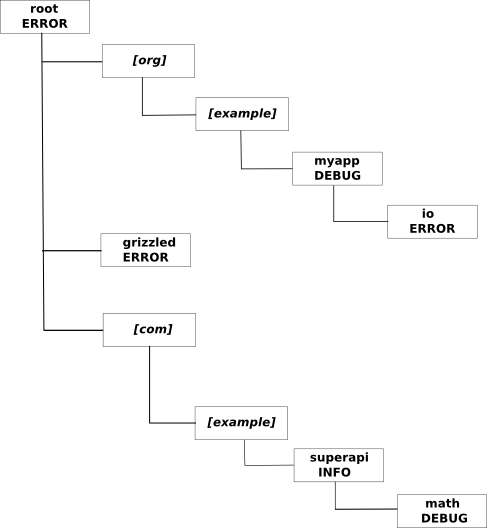

## Introduction

AVSL is *a very simple logger*, written in [Scala][]. AVSL implements the
[Simple Logging Facade for Java][SLF4J] (SLF4J) API, allowing applications
to be written to the [SLF4J][] API. (This, of course, includes Java
applications.) Because it implements SLF4J, AVSL can easily be swapped for
another SLF4J-compatible logging framework (or the other way around),
without any changes to the calling application. Also, because it supports
SLF4J, AVSL can be used in conjunction with Scala SLF4J wrappers, such as
[Grizzled-SLF4J][].

"AVSL" stands for "A Very Simple Logger", and AVSL strives for simplicity
in several ways.

* AVSL is simple to configure, using a non-XML, INI-style configuration
  file that's reminiscent of the [Python logging module][]'s configuration.
  This simpler configuration file is easier to read and edit than the XML
  configuration files used by logging frameworks such as [Logback][].
  (Since I dislike XML configuration files, this is big win for me.)
* AVSL is a lightweight logging framework. It is intended to be used
  primarily in standalone programs, not enterprise applications. It may
  work fine for your enterprise application, of course; but, if it doesn't,
  you can easily switch to something else.
* The default message formatter uses a simpler, more compact syntax than
  Java's `SimpleDateFormat`, relying on `strftime`-like escapes.
* You can specify the configuration file via an environment variable
  (`AVSL_CONFIG`) or a Java system property. If neither is present, AVSL
  looks for resource `avsl.conf` somewhere in the classpath.
* AVSL does not monitor and reload its configuration file.
* AVSL does not implement the SLF4J marker or MDC capabilities.
* AVSL does not wrap other logging frameworks.
* AVSL does not let programmers define their own log levels.

In short, AVSL is a perfectly serviceable, simple logging framework that can
easily be swapped out for something with more features.

## Installation

The easiest way to install the AVSL library is to download a pre-compiled
jar from the [*clapper.org* Maven repository][]. However, you can also get
certain build tools to download it for you.

### Installing for Maven

If you're using [Maven][], you can get AVSL from the
[*clapper.org* Maven Repository][]. The relevant pieces of information are:

* Group ID: `clapper.org`
* Artifact ID: `avsl_`*scala-version*
* Version: `0.2.3`
* Type: `jar`
* Repository: `http://maven.clapper.org/`

Substitute either "2.8.0.RC3" or "2.8.0.RC2" for *scala-version*. Examples:

Here's a sample Maven POM "dependency" snippet:

    <dependency>
      <groupId>org.clapper</groupId>
      <artifactId>avsl_2.8.0.RC2</artifactId>
      <version>0.2.3</version>
    </dependency>

### Using with SBT

If you're using [SBT][] (the Simple Build Tool) to compile your code, you
can place the following lines in your project file (i.e., the Scala file in
your `project/build/` directory):

    val javaNetRepo = "Java.net Repository for Maven" at
        "http://download.java.net/maven/2"
    val newReleaseToolsRepository = ScalaToolsSnapshots
    val orgClapperRepo = "clapper.org Maven Repository" at
        "http://maven.clapper.org"
    val avsl = "org.clapper" %% "avsl" % "0.2.3"

**NOTES**

1. The first doubled percent is *not* a typo. It tells SBT to treat
   AVSL as a cross-built library and automatically inserts the
   Scala version you're using into the artifact ID. It will *only* work if
   you are building with Scala 2.8.0.RC2 or Scala 2.8.0.RC3. See the
   [SBT cross-building][] page for details.
   
2. You *must* specify the Java.net and `ScalaToolsSnapshots` repositories,
   in addition to the `maven.clapper.org` repository. Even though those
   additional repositories are in the published AVSL Maven `pom.xml`, SBT
   will not read them. Under the covers, SBT uses [Apache Ivy][] for
   dependency management, and Ivy doesn't extract repositories from Maven
   POM files. If you don't explicitly specify the additional repositories
   listed above, `sbt update` will fail. See
   [Library Management Maven/Ivy section][] in the [SBT Manual][] for
   details. Also see this [email thread][SBT-repo-email-thread].
   Depending on your circumstances, you may also need to specify the
   dependent repositories used by the [Grizzled Scala][] library.

## Source Code Repository

The source code for AVSL is maintained on [GitHub][]. To clone the
repository, run this command:

    git clone git://github.com/bmc/avsl.git

## Building from Source

Building the library requires [SBT][] and Scala 2.8.0.RC3 or Scala 2.8.0.RC2.
Install SBT, as described at the SBT web site. Then, assuming you have an
`sbt` shell script (or .BAT file, for Windows), run:

    sbt update

That command will pull down the external jars on which the AVSL
Library depends. After that step, build the library with:

    sbt compile package

The resulting jar file will be in the top-level `target` directory.

## A brief overview of log levels and loggers

### Log levels

Like most logging frameworks, AVSL segregates log messages into logging
levels, allowing fine-grained control over the levels. It supports the
following levels:

- `Error` (value 50)
- `Warn` (value 40)
- `Info` (value 30)
- `Debug` (value 20)
- `Trace` (value 10)

Log messages are tagged with log levels and are only displayed if:

1. The logger's log level is equal to or numerically lower than the message's
   level. e.g., If the logger is configured at level `Info`, then messages
   written at level `Debug` will be suppressed.
2. The handlers associated with the logger have levels that are equal or
   numerically lower than the message's level. This approach allows you to
   direct messages to different handlers, depending on their log levels.
   
Unlike other frameworks, AVSL has no provision for extending or augmenting
the log levels. In keeping with the notion of simplicity, the log levels
are fixed and cannot be altered or extended.

### Hierarchical loggers

Also like most logging frameworks, AVSL's loggers are hierarchical. At the
top of the hierarchy sits the root logger. Underneath the root logger are
hierarchies of named loggers. If the calling program requests the logger
for a specific name, AVSL uses the most specific logger it can find for
that name, defaulting to the top-level root logger if nothing more specific
can be found. By convention, logger names are class names, which fit neatly
into a hierarchy.

An example will help clarify the approach. Consider a configuration that
specifies the following individual (named) loggers:

    root (log level ERROR)
    org.example.myapp (log level DEBUG)
    org.example.myapp.io (log level ERROR)
    org.clapper.grizzled (log level ERROR)
    com.example.superapi (log level INFO)
    com.example.superapi.math (log level DEBUG)

Internally, AVSL will convert such a configuration to the following tree
of loggers:

In the diagram, names in brackets are placeholders; they exist in the tree,
to establish the hierarchy, but they have no associated loggers.

If a calling program using the above configuration asks for a named logger,
AVSL will find the most specific logger for the name. Here are some examples:

- `org.example.myapp`: AVSL will return the configured logger for this name,
   with level DEBUG.
- `org.example`: Neither `org.example` nor `org` has a configured logger, so
  AVSL returns the root logger, with level ERROR.
- `grizzled.io`: There's no configured logger for `grizzled.io`, but there *is*
  a configured logger for the parent `grizzled` name, so AVSL returns that
  logger, with level ERROR.
- `com.example.superapi.math`: AVSL returns the configured logger for this
  name, with level DEBUG.
- `com.example.superapi`: AVSL returns the configured logger for this
  name, with level INFO.
- `com.example.superapi.util`: There is no configured logger for
  `com.example.superapi.util`, so AVSL returns the logger for
  `com.example.superapi`, with level INFO.
- `org.scala-tools`: Neither `org.scala-tools` nor `org` has a configured
  logger, so AVSL returns the root logger.

## Using AVSL in your code

Logging via AVSL is straightforward. There are two basic approaches.

### Using AVSL via SLF4J

The recommended way to use AVSL is via [SLF4J][], because using the SLF4J
API isolates your code from the underlying logging API and allows you to
switch to any other SLF4J-compliant logging framework without changing your
code. If you write to the SLF4J API, you can start out using AVSL, and your
code will also work with [Logback][], `java.util.logging`, Log4J, and other
logging frameworks.

Just write your code to the SLF4J API, and ensure that AVSL is the only
logging framework in your CLASSPATH.

If you're using Scala, you can also use more Scala-friendly SLF4J wrapper
APIs, such as [Grizzled-SLF4J][].

#### Using SLF4J directly

If you're using SLF4J directly, you can simply instantiate an SLF4J logger.
Here's a Java example:

    import org.slf4j.*;

    class MyClass
    {
        private Logger logger = LoggerFactory.getLogger(MyClass.class);

        ...

        public void someMethod()
        {
            logger.debug("Entering someMethod()");
            ...
            logger.debug("Exiting someMethod()");
        }
    }

Here's a Scala example:

    import org.slf4j._
    
    class MyClass
    {
        val logger = LoggerFactory.getLogger(classOf[MyClass])

        def someMethod =
        {
            logger.debug("Entering someMethod()")
            ...
            logger.debug("Exiting someMethod()")
        }
    }

#### Using SLF4J via the Grizzled-SLF4J wrapper

If you're writing in Scala, you may want to use a more Scala-friendly wrapper.
One example is my [Grizzled-SLF4J][] wrapper. Here's the above example,
with Grizzled-SLF4J:

    import grizzled.slf4j._
    
    class MyClass
    {
        val logger = Logger(classOf[MyClass])

        def someMethod =
        {
            logger.debug("Entering someMethod()")
            ...
            logger.debug("Exiting someMethod()")
        }
    }

### Using AVSL directly

While you really should use the SLF4J interface, for portability, there's
nothing stopping you from using the AVSL API directly. Doing so is easy
enough, as this example shows:

    package org.example.cooltool

    import org.clapper.avsl.Logger

    class MyClass
    {
        val logger = Logger(classOf[MyClass])
        
        logger.debug("Initialized new MyClass instance")
        ...
    }
    
The methods in the `Logger` class are similar to those in Grizzled-SLF4J: They
use Scala's [call-by-name][] capability to delay evaluation of the arguments
passed to the methods. `Logger.debug()`, for instance, is defined as:

    def debug(message: => String)

Consult the [API documentation][] for complete details.

## Configuring AVSL

AVSL uses a simple INI-style configuration file, reminiscent of the
[Python logging module][]'s configuration. This section describes that
file in detail.

### An overview of configuration file syntax

AVSL uses the [Grizzled Scala][] library's `grizzled.config` module to parse
its configuration, so it supports all the capabilities that module provides.
The configuration file is a Win.INI-style file, with several enhancements,
and supports:

* Sections, like traditional Windows INI files
* Include directives, so you can include other files within the configuration
* Variable substitutions, allowing you to put common definitions in one section,
  to be used throughout other sections.
* Special `env` and `system` pseudo-sections. See `Variable Substitution`,
  below.
* Java-style metacharacters like `\t`, `\n` and `\u00a9`.
* Comment lines, starting with a "#" character

Each section consists of a set of variable/value pairs. Variable names can
consist of alphanumerics and underscores; values can contain anything. AVSL
strips leading and trailing white space from the values.

Variables and values are separated either by "=" or ":". For example, the 
following settings are identical:

    foo: bar
    foo=bar
    foo:bar
    foo = bar

There's also a special "raw" assignment operator, `->` that suppresses variable
and metacharacter expansion. Thus, to assign the literal value of "$bar" to
variable `foo`, use

    foo -> $bar

not

    foo = $bar

AVSL looks for several special sections, based on their names or prefixes.
Other sections are permitted, but AVSL doesn't explicitly use them. You
can use other sections for common variable definitions; a section called
"common" or "vars" is often useful for that.

#### Including other configuration files

A special `include` directive permits inline inclusion of another
configuration file. The include directive takes two forms:

     %include "path"
     %include "URL"

For example:

     %include "common.cfg"
     %include "/etc/sqlshell/common.cfg"
     %include "http://configs.example.com/mytools/common.cfg"

If the include path is not a URL, and is not an absolute path, its location 
is relative to the file that's trying to include it.

The included file may contain any content that is valid for this parser. It
may contain just variable definitions (i.e., the contents of a section,
without the section header), or it may contain a complete configuration
file, with individual sections. Since AVSL recognizes a variable syntax
that is essentially identical to Java's properties file syntax, it's also
legal to include a properties file, provided it's included within a valid
section.

#### Variable Substitution

A variable value can interpolate the values of other variables, using a
variable substitution syntax. The general form of a variable reference is
`${sectionName.varName}`. In many cases, the braces can be omitted (e.g.,
`$sectionName.varName`.

* `sectionName` is the name of the section containing the variable to
  substitute; if omitted, it defaults to the current section.
* `varName` is the name of the variable to substitute. 

If a variable reference specifies a section name, the referenced section
must precede the current section. It is not possible to substitute the
value of a variable in a section that occurs later in the file.

AVSL's configuration supports two special pseudo-sections. These
sections don't really exist, but they can be referenced in variable
substitutions.

`env`

> The `env` pseudo-section contains all the environment variables available
> to AVSL. For example, on a Unix-like system, you can refer to
> `${env.HOME}` (or `$env.HOME`) to get the home directory of the user
> who's running AVSL. On some versions of Windows, `${env.USERNAME}`
> will substitute the name of the user running AVSL. Note: On UNIX
> systems, environment variable names are typically case-sensitive; for
> instance, `${env.USER}` and `${env.user}` refer to different environment
> variables. On Windows systems, environment variable names are typically
> case-insensitive, so `${env.USERNAME}` and `${env.username}` are
> equivalent.

`system`

> The `system` pseudo-section contains all the Java and Scala properties.
> For example, `${system.user.name}` (or `$system.user.name`) gets the
> Java property corresponding to the user's name.

Notes and caveats:

* Variable substitutions are only permitted within variable values. They
  are ignored in variable names, section names, include directives and
  comments.
* Variable substitution is performed after metacharacter expansion (so
  don't include metacharacter sequences in your variable names).
* To include a literal "$" character in a variable value, escape it with a
  backslash, e.g., "var=value with \$ dollar sign", or use the `->` assignment
  operator.

### The AVSL configuration file in depth

An AVSL configuration file consists of three kinds of sections:

- Logger sections (whose names start with `logger_`) configure specific
  loggers.
- Handler sections (whose names start with `handler_`) configure message
  handlers, which are responsible to dispatching log messages to various
  places (files, the screen, etc.)
- Formatter sections (whose names start with `formatter_`) configure
  message formatters, which control the formats of log messages.

Here's an example configuration:

    [logger_root]
    level: info
    handlers: h1, h2

    [logger_org_clapper]
    pattern: org.clapper
    level: debug
    handlers: h1

    [logger_org_clapper_avsl]
    pattern: org.clapper.avsl
    level: info
    handlers: h1, h2

    [logger_baz]
    pattern: grizzled.
    level: error
    handlers: h1

    [handler_h1]
    level: debug
    class: FileHandler
    path: /tmp/log
    formatter: f1
    append: true

    [handler_h2]
    level: trace
    class: ConsoleHandler
    formatter: f2

    [formatter_f1]
    class: DefaultFormatter
    format: [%Y/%m/%d %h:%m:%s:%S %z] (%l) %t
    tz: PDT

    [formatter_f2]
    class: DefaultFormatter
    format: [%Y/%m/%d %h:%m:%s:%S %z] (%l) %n: %t

#### The `logger` sections

Each `logger_` section specifies the logging parameters for an individual
logger. The special `logger_root` section allows you to configure the
aspects of the root (i.e., default) logger; if you omit the `logger_root`
section, AVSL will assume a reasonable default.

`logger_` sections have the following values:

- `level`: The log level associated with the logger. Required.
- `pattern`: The name pattern for the logger, typically the portion of the
  class name the logger should match. This paramter is ignored for the root
  logger, but required for all other loggers.
- `handlers`: The names of one or more handlers to associate with the logger.
  At least one handler is required.

#### The `handler` sections

Handler sections identify message handlers, which are responsible for
dispatching messages to their final destinations.

`handler_` sections have the following values:

- `level`: The log level associated with the handler. Required.
- `class`: The name of the class that implements the handler. Built-in handlers
  also support shortcut aliases; see below. Required.
- `formatter`: The name of the formatter to use to format the messages.
  If not specified, the default formatter (`SimpleFormatter`) is used, with
  a default format pattern.

All other values in the section are assumed to be arguments (in the form
of name/value pairs) to be passed to the constructor of the handler class.

`logger` sections refer to handlers by their names. The name of a handler
is its section name, minus the `handler_` prefix.

##### Built-in handlers

AVSL supports the following built-in handlers.

**ConsoleHandler**

The `org.clapper.avsl.ConsoleHandler` class (shortcut alias: `ConsoleHandler`)
simply writes log messages to the console. Sample configuration:

    [handler_console]
    level: warn
    class: ConsoleHandler
    formatter: f1

**NullHandler**

The `org.clapper.avsl.handler.NullHandler` class (shortcut alias:
`NullHandler`) simply swallows all messages routed to it. Sample
configuration:

    [handler_null]
    level: trace
    class: NullHandler

**FileHandler**

The `org.clapper.avsl.handler.FileHandler` class (shortcut alias:
`FileHandler`) writes its output to a file. In addition to the standard
`formatter` and `level` parameters, it also supports the following
parameters:

- `path`: Path to the log file. Required.
- `append`: Whether or not to append to the file (`true`, `yes`, or `1`)
  or overwrite it (`false`, `no`, or `0`). Optional. Defaults to `false`.
  
The `FileHandler` does *not* currently support log file rolling.

**EmailHandler**

The `org.clapper.avsl.handler.EmailHandler` class (shortcut alias:
`EmailHandler`) emails each message it receives to one or more recipients.
In addition to the standard `formatter` and `level` parameters, it also
supports the following parameters:

- `sender`: Email address of the sender, specified as a standard [RFC822][]
  address. Required.
- `recipients`: Comma-separated list of recipients, as standard [RFC822][]
  addresses. Required.
- `smtp.server`: Host name or address of the SMTP server. Optional. Defaults
  to "localhost".
- `smtp.port`: Integer port on which the SMTP server accepts transmissions.
  Optional. Defaults to 25.
- `subject`: The subject of the message. May contain a "%l" escape, which is
  replaced by the level (INFO, ERROR, etc.) of the message being emailed.
  Optional. Defaults to "%l message".
  
**NOTE:** If you use this handler, you must have the latest version of
the [JavaMail API][] `mail.jar` file in your CLASSPATH.

#### The `formatter` sections

`formatter_` sections define formatters. A formatter takes a log message
(represented internally by a `LogMessage` object) and converts it to a string.

`formatter_` sections have the following values:

- `class`: The name of the class that implements the formatter. Built-in
  formatters also support shortcut aliases; see below. Optional. If not
  specified, the default formatter (`SimpleFormatter`) is used.

All other values in the section are assumed to be arguments (in the form
of name/value pairs) to be passed to the constructor of the handler class.

`handler` sections refer to formatters by their names. The name of a
formatter is its section name, minus the `formatter_` prefix.

##### Built-in formatters

AVSL currently supplies two built-in formatters, described below.

**NullFormatter**

The `org.clapper.avsl.formatter.NullFormatter` class (shortcut alias:
`NullFormatter`) simply returns the empty string, always. It's useful
primarily for testing.

    [formatter_null]
    level: trace
    class: NullFormatter

**SimpleFormatter**

The `org.clapper.avsl.formatter.SimpleFormatter` class (shortcut alias:
`SimpleFormatter`) is the default formatter for the AVSL logger. It
uses simple %-escaped format strings, akin to the standard C
[`strftime`][strftime] function. In fact, some of the escapes are borrowed
directly from `strftime`. These escapes, described below, are more compact
than the format strings used by Java's `SimpleDateFormat` class; they also
don't suffer from the odd quoting conventions imposed by
`SimpleDateFormat`. However, they are mapped to `SimpleDateFormat`
patterns, so they are locale-, language-, and time zone-sensitive.

A `SimpleFormatter` accepts the following name/value pair arguments:

- `format`: The format to use. If not specified, the default is
  `[%Y/%m/%d %H:%M:%s:%S] %l %n %t`. See below for an explanation of the
  format string.
- `language`: The language to use when formatting dates, using the Java
  `Locale` values. If not specified, the default locale is used.
- `country`: The country to use when formatting dates, using the Java
  `Locale` values. If not specified, the default locale is used.
- `tz`: The time zone to use. If not specified, the default is used.

The recognized format escapes are shown below. Anything else is displayed
literally. Many of the escapes are borrowed directly from `strftime()`.

- `%a`: the short day-of-week name (e.g., "Wed")
- `%A`: the long day-of-week name (e.g., "Wednesday")
- `%b`: the abbreviated month name (e.g., "Mar", "Nov")
- `%B`: the full month name (e.g., "March", "November")
- `%d`: the day of the month
- `%D`: equivalent to %m/%d/%y
- `%F`: equivalent to %Y/%m/%d
- `%h`: the hour of the day (0-23)
- `%H`: the hour of the day (1-12)
- `%j`: the day of the year (i.e., the so-called Julian day)
- `%l`: the log level name (e.g., "INFO", "DEBUG")
- `%L`: the log level's numeric value
- `%m`: the month number (01-12)
- `%M`: the current minute, zero-padded
- `%n`: the short name of the logger (i.e., the last element of the class name)
- `%N`: the full name of the logger (i.e., the class name)
- `%s`: the current second, zero-padded
- `%S`: the current millisecond, zero-padded
- `%t`: the text of the log message
- `%T`: the current thread name
- `%y`: the 2-digit year
- `%Y`: the full 4-digit year
- `%z`: the time zone name (e.g., "UTC", "PDT", "EST")
- `%%`: a literal "%"

### Specifying the location of the configuration file

See [Locating the configuration file][] in the [AVSL at runtime][] section,
below.

[AVSL at runtime]: #avsl_at_runtime
[Locating the configuration file]: #locating_the_configuration_file

## AVSL at runtime

### Necessary jar files

To run your program with AVSL, you'll need to have the following jar files
in your CLASSPATH at runtime:

- The AVSL jar file
- The [Grizzled Scala][] jar file.
- The `slf4j-api.jar` jar file (assuming you're using the SLF4J interface,
  which is recommended).
- The `grizzled-slf4j.jar` jar file, if you're using the [Grizzled-SLF4J][]
  Scala-SLF4J wrapper.
- The [JavaMail API][] `mail.jar` jar file, if you're using the `EmailHandler`.

### Locating the configuration file

AVSL looks for the URL or path to its configuration file in the following
places, in the order listed:

- It first checks the `AVSL_CONFIG` environment variable for a pathname or URL.
- If the `AVSL_CONFIG` is missing or empty, AVSL then looks in the
  `org.clapper.avsl.config` system property for a pathname or URL.
- If both the environment variable and the system property are missing or
  empty, AVSL looks for a file called `avsl.conf` somewhere in the classpath
  (i.e., in the top-level directory of a directory in the classpath, or in
  the top-level folder of a jar file in the classpath).

If AVSL is unable to find a configuration file in any of those places, then
it quietly disables logging.

## Extending AVSL

You are free to write your own formatters and handlers for use with AVSL.
Since AVSL is written in Scala, Scala is your best choice for extending the
API. However, with a little effort, you can also use Java.

### Arguments to handlers and formatters

As noted in the configuration sections, handlers and formatters can receive
arbitrary arguments. Those arguments, taken directly from the corresponding
configuration sections, are passed as name/value pairs and are stored in a
special `org.clapper.avsl.config.ConfiguredArguments` object. In Scala,
the `ConfiguredArguments` class looks like this:

    // Scala
    class ConfiguredArguments ...
    {
        /**
         * Get a named value from the arguments, throwing an exception if
         * not found.
         *
         * @param name  the name of the parameter to retrieve
         *
         * @return the value
         *
         * @throws NoSuchElementException if not found
         */
        def apply(name: String)

        /**
         * Get a named value from the arguments.
         *
         * @param name  the name of the parameter to retrieve
         *
         * @return Some(value) if found, None if not.
         */
        def get(name: String): Option[String]

        /**
         * Get a named value from the arguments, supplying a default if not
         * found.
         *
         * @param name  the name of the parameter to retrieve
         *
         * @return the retrieved value, or default if not found.
         */
        def getOrElse(name: String, default: String)
    }

Thus, a `ConfiguredArguments` object behaves like a Scala `Map`. (A `Map`
is not used directly, to make it easier to use the class from Java.)

In Java, the same class looks like this:

    // Java
    class ConfiguredArguments extends Object implements scala.ScalaObject
    {
        public String apply(String name);
        public scala.Option get(String name);
        public String getOrElse(String name, String value);
    }
    
When writing a handler or formatter in Java, the best way to handle optional
values is via the `getOrElse()` method. For example:

    // Java
    if (args.getOrElse("foo", null) == null) // "foo" not supplied

### Writing a new handler

To write a new handler, you must extend the `org.clapper.avsl.handler.Handler`
trait, which looks like this:

    // Scala
    trait Handler
    {
        val level: org.clapper.avsl.LogLevel
        val formatter: org.clapper.avsl.formatter.Formatter
        def log(message: String, logMessage: LogMessage): Unit
    }

In Java, this trait looks like the following interface:

    // Java
    public interface Handler
    {
        public org.clapper.avsl.LogLevel level();
        public clapper.avsl.formatter.Formatter formatter();
        public void log(String message);
    } 

You must also provide a constructor that takes three parameters, in order:

- An `args` parameter, of type `ConfiguredArguments`. (See above.)
  `ConfiguredArgs` contains custom name-value parameters for the handler,
  taken directly from the handler's configuration section.
- A `Formatter` parameter, to be assigned to the `formatter` value (or
  returned by the `formatter()` method, if you're using Java).
- A `LogLevel` parameter, to be assigned to the `level` value (or
  returned by the `level()` method, if you're using Java).

Handlers do *not* need to worry about thread safety, and they do *not* need
to format log messages. Those concerns are handled by the framework. Most
handlers won't need to use the `logMessage` parameter that is passed to the
`log()` method; that parameter exists just in case a handler needs access
to the raw pieces. The `message` parameter contains the already formatted
log message.

The `ConsoleHandler`, which writes its output to the console, is a simple
example of a handler:

    package org.clapper.avsl.handler

    import org.clapper.avsl.formatter.Formatter
    import org.clapper.avsl.config.ConfiguredArguments
    import org.clapper.avsl.LogLevel

    class ConsoleHandler(args: ConfiguredArguments,
                         val formatter: Formatter,
                         val level: LogLevel)
    extends Handler
    {
        def log(message: String, logMessage: LogMessage) = Console.println(message)
    }

### Writing a new formatter

To write a new formatter, you must extend the
`org.clapper.avsl.formatter.Formatter` trait, which looks like this:

    // Scala
    trait Formatter
    {
        def format(logMessage: org.clapper.avsl.LogMessage): String
    }

In Java, this trait looks like the following interface:

    // Java
    public interface Formatter
    {
        public String format(org.clapper.avsl.LogMessage logMessage);
    }    

`LogMessage` describes the message to be logged; it looks like this:

    // Scala
    case class LogMessage(name: String,
                          date: Long,
                          level: LogLevel,
                          message: AnyRef,
                          exception: Option[Throwable])

    // Java
    public class LogMessage extends Object implements scala.ScalaObject
    {
        public String name();
        public long date();
        public LogLevel level();
        public Object message();
        public scala.Option exception();
    }

You must also provide a constructor that takes an `args` parameter, of type
`ConfiguredArguments`. (See above.) `ConfiguredArgs` contains custom
name-value parameters for the formatter, taken directly from the
formatter's configuration section.

Formatters do *not* need to worry about thread safety.

The following Scala code, which formats all messages the same way, serves
as a simple example of a formatter:

    import org.clapper.avsl.formatter.Formatter
    import org.clapper.avsl.config.ConfiguredArguments
    import org.clapper.avsl.LogLevel
    import java.text.SimpleDateFormat

    class MyFormatter(args: ConfiguredArguments) extends Formatter
    {
        private val dateFormat = new SimpleDateFormat("yyyy/MM/DD HH:mm:ss.SSS")
        def format(logMessage: LogMessage): String =
        {
            val exception = logMessage match
            {
                case None     => ""
                case Some(ex) => ex.getMessage
            }

            dateFormat.format(new Date(logMessage.date)) + " "
            logMessage.level.label + " "
            logMessage.name + " "
            logMessage.message + exception
        }
    }

## Author

Brian M. Clapper, [bmc@clapper.org][]

## Copyright and License

AVSL is copyright &copy; 2010 Brian M. Clapper and is released under a
[BSD License][].

## Patches

I gladly accept patches from their original authors. Feel free to email
patches to me or to fork the [GitHub repository][] and send me a pull
request. Along with any patch you send:

* Please state that the patch is your original work.
* Please indicate that you license the work to the AVSL project
  under a [BSD License][].

[BSD License]: license.html
[GitHub repository]: http://github.com/bmc/avsl
[Grizzled-SLF4J]: http://bmc.github.com/grizzled-slf4j/
[GitHub]: http://github.com/bmc/
[downloads area]: http://github.com/bmc/avsl/downloads
[*clapper.org* Maven repository]: http://maven.clapper.org/org/clapper/
[Maven]: http://maven.apache.org/
[bmc@clapper.org]: mailto:bmc@clapper.org
[Scala]: http://www.scala-lang.org/
[Python logging module]: http://docs.python.org/library/logging.html
[SLF4J]: http://slf4j.org/
[Logback]: http://logback.qos.ch/
[Grizzled Scala]: http://bmc.github.com/grizzled-scala/
[SBT]: http://code.google.com/p/simple-build-tool
[strftime]: http://www.opengroup.org/onlinepubs/007908799/xsh/strftime.html
[call-by-name]: http://eed3si9n.com/scala-and-evaluation-strategy
[API documentation]: api
[RFC822]: http://www.ietf.org/rfc/rfc822.txt
[JavaMail API]: http://java.sun.com/products/javamail/
[SBT cross-building]: http://code.google.com/p/simple-build-tool/wiki/CrossBuild
[Apache Ivy]: http://ant.apache.org/ivy/
[Library Management Maven/Ivy section]: http://code.google.com/p/simple-build-tool/wiki/LibraryManagement#Maven/Ivy
[SBT Manual]: http://code.google.com/p/simple-build-tool/wiki/DocumentationHome
[SBT-repo-email-thread]: http://groups.google.com/group/simple-build-tool/browse_thread/thread/470bba921252a167
